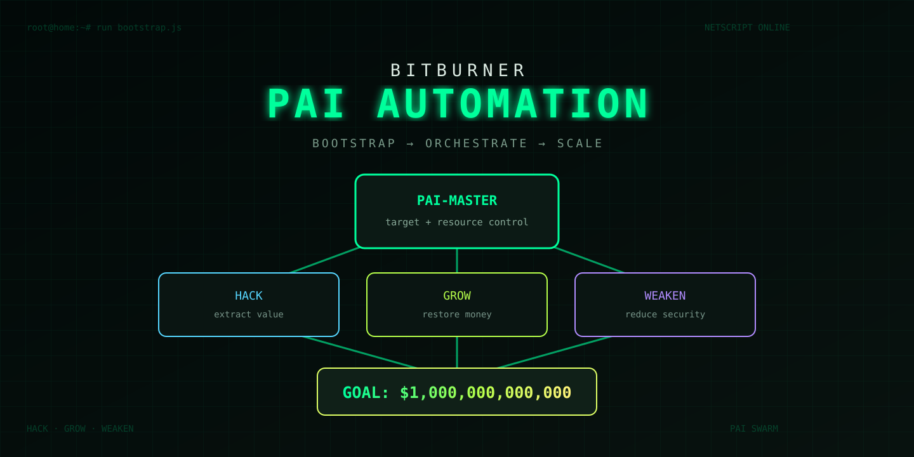
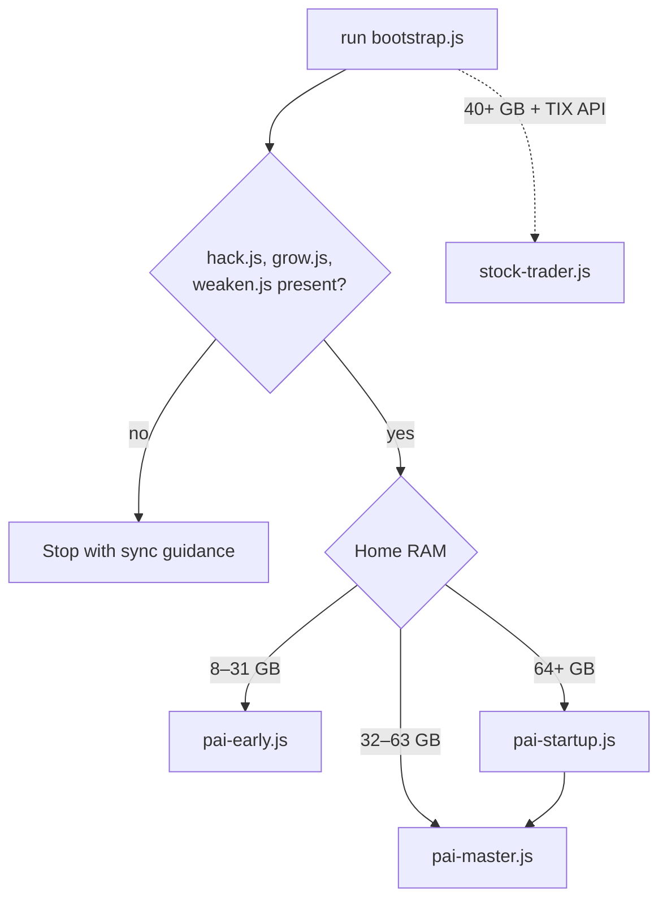
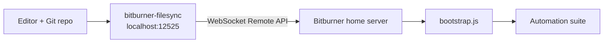
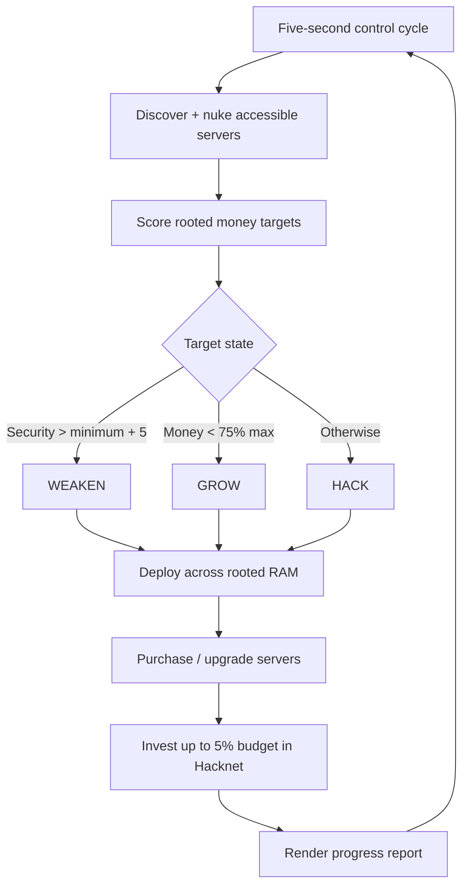
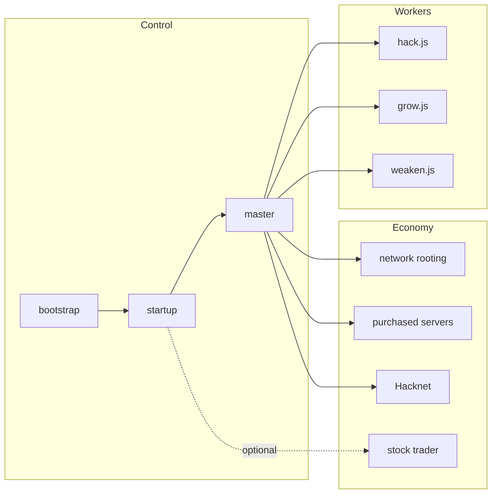

<p align="center"></p>

<h1 align="center">Bitburner PAI Automation Suite</h1>

<p align="center"><strong>One restart command. One distributed hacking swarm. One trillion-dollar target.</strong></p>

> [!NOTE]
> This repository contains Netscript automation for the game [Bitburner](https://github.com/bitburner-official/bitburner-src). It does not attack real systems.

## Start here

After syncing the scripts into the game, run:

```text
run bootstrap.js
```

`bootstrap.js` inspects home RAM, verifies the three core workers, stops conflicting PAI entry points, and launches the best available controller.



The thresholds above describe the decision logic in the current source. Actual launch success also depends on the game's calculated script RAM and available home RAM.

## Sync from your editor

The checked-in [`filesync.json`](filesync.json) is configured for `bitburner-filesync` on port `12525` and pushes `.js`, `.script`, and `.txt` files from the repository root.

```bash
npx bitburner-filesync
```

In Bitburner, open **Options → Remote API** and connect to `localhost:12525` with WSS disabled.



Start the sync service before connecting from the game. If `localhost` resolves incorrectly, try `127.0.0.1`.

## Core automation loop

The supported full controller is [`pai-master.js`](pai-master.js). Every five seconds it discovers the network, roots newly accessible hosts, picks a viable money target, chooses the action demanded by current server state, deploys workers across rooted RAM, manages purchased servers, and invests a bounded share in Hacknet.



Target ranking combines maximum money, minimum security, and hack success chance. Home reserves 64 GB under the master configuration; other rooted servers contribute available RAM without that reserve.

## Script families

This repository records several generations of the automation. They are useful, but they are not all meant to run together.

| Family | Files | Intended use |
| --- | --- | --- |
| Bootstrap | `bootstrap.js` | Recommended resource-aware entry point |
| Full suite | `pai-startup.js`, `pai-master.js` | Distributed orchestration and optional stock trading |
| Low-RAM progression | `pai-early.js`, `pai-simple.js`, `early.js` | Fresh starts and constrained home RAM |
| Specialized PAI | `pai-network.js`, `pai-hacknet.js`, `pai-money.js`, `pai-xp-boost.js` | Focused network, passive-income, money, or XP tasks |
| Core workers | `hack.js`, `grow.js`, `weaken.js`, `worker.js` | Single-purpose actions deployed by controllers |
| Lightweight swarm | `manager.js`, `deploy.js`, `go.js` | Compact distributed worker strategies |
| Command / UI experiments | `pai-commander.js`, `pai-cmd-lite.js`, `cmd.js`, `pai-dashboard.js` | Manual control and status interfaces |
| Legacy experiments | `orch-master-all-in-one.js`, `GodFarm.js`, `hacknetAutoUpgrader.js`, others | Earlier strategies retained for reference |



The `pai-agents/README.md` describes an experimental phased architecture and mentions `pai-upgrade.js`, which is not present in the current repository. Treat it as design history rather than the main quick start.

## Progression

| Stage | Typical home RAM | Recommended entry | Focus |
| --- | ---: | --- | --- |
| Fresh start | 8–31 GB | `bootstrap.js` → `pai-early.js` | Skill and initial money |
| Developing | 32–63 GB | `bootstrap.js` → `pai-master.js` | Rooting and distributed income |
| Full automation | 64+ GB | `bootstrap.js` → `pai-startup.js` | Master controller plus eligible subsystems |
| Optional market layer | 40+ GB and TIX access | `stock-trader.js` | Forecast-driven stock positions |

After installing augmentations, scripts remain on `home` while purchased servers are reset. Run `bootstrap.js` again so the suite can choose appropriately for the new resource state.

## Structured logs

PAI scripts generally report intent and outcome in a consistent form:

```text
[PAI-Coordinator] PURPOSE: Execute WEAKEN on target
[PAI-Coordinator] ACTION: Deployed weaken.js across 8 servers
[PAI-Coordinator] RESULT: 312 threads launched
```

The master dashboard additionally tracks goal progress, current funds, earned funds, rate, ETA, purchased servers, Hacknet nodes, newly rooted servers, target, cycles, and runtime.

## Validate changes

The scripts use Bitburner's global `NS` API and therefore cannot be meaningfully executed under Node.js. Node can still catch JavaScript syntax errors:

```bash
for script in *.js; do node --check "$script"; done
```

Behavioral validation belongs inside Bitburner. Test entry-point selection after a restart, confirm worker files sync to `home`, and watch RAM allocation and logs before leaving a controller unattended.

## Important boundaries

- Scripts can spend in-game money, purchase and replace in-game servers, trade in-game stocks, terminate in-game processes, and reset worker placement.
- Do not launch multiple master/orchestrator generations simultaneously unless you intentionally want them competing for RAM and money.
- RAM figures in documentation are approximate because Bitburner calculates cost from the APIs referenced by each script.
- This repository does not currently include a license file; no license grant should be inferred from older prose in `README.master.md`.

## Repository map

```text
.
├── bootstrap.js                # Recommended entry point
├── pai-startup.js              # Full-suite launcher
├── pai-master.js               # Current $1T controller
├── hack.js / grow.js / weaken.js
├── pai-*.js                    # Specialized and experimental agents
├── manager.js / deploy.js      # Compact distributed alternatives
├── filesync.json               # Remote API sync configuration
├── README.*                    # Historical component documentation
└── assets/readme-hero.svg      # README title artwork
```

---

<p align="center"><strong>Automate the loop. Scale the swarm. Let the terminal count the zeroes.</strong></p>
